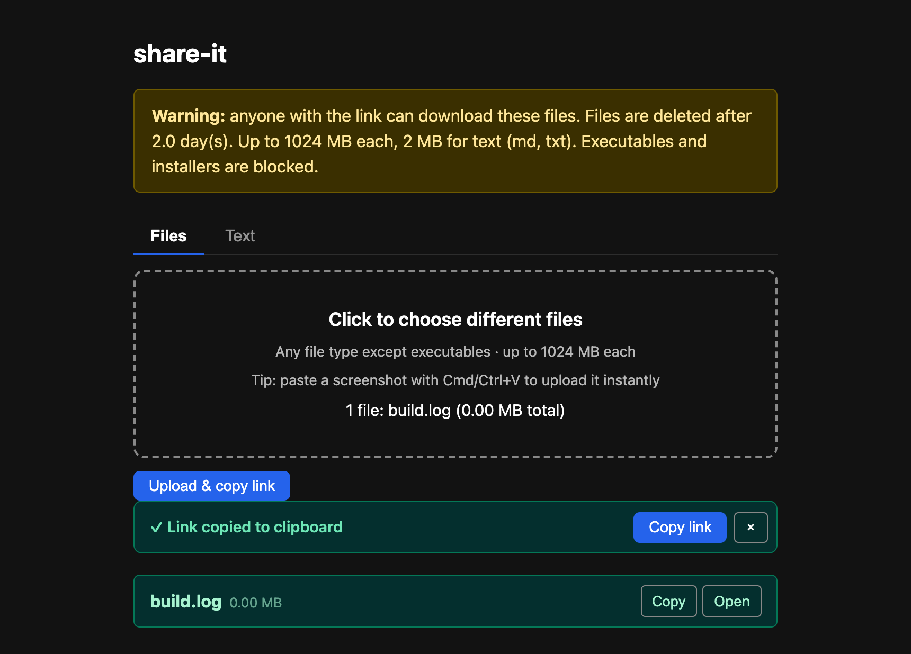
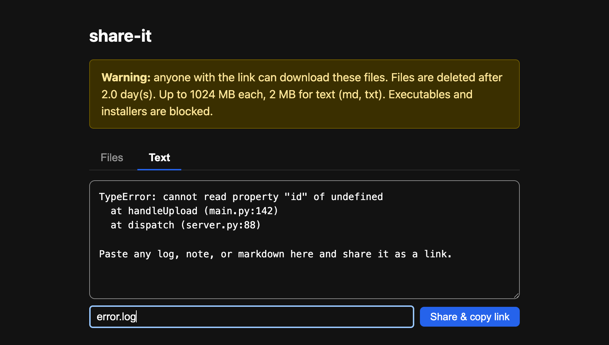

# share-it

**Can't paste it? Drop it here and get a link instead.**

Some things are annoying to move around: a file with no "upload" button, a wall of text that gets cut off when you paste it, a screenshot you need on your phone. **share-it** is one small private spot on your own network where you drop any of that and instantly get back a link. Hand the link to another device, a teammate, or an AI chat.

No accounts. No cloud. Nothing leaves your network.



---

## Why it exists

It started with one specific, repeated annoyance: trying to get a file or a long chunk of text **into an AI coding chat** like Claude Code.

Sometimes copy-paste worked. Mostly it didn't — the text would silently get cut off, or the terminal would lock up. This isn't just bad luck; it's a recurring problem, reported over and over across versions and platforms:

- Pasted text [truncated mid-word](https://github.com/anthropics/claude-code/issues/13125) when it's long
- [Large pastes silently dropped](https://github.com/anthropics/claude-code/issues/49673) from the input
- The same [truncation on Windows](https://github.com/anthropics/claude-code/issues/50250), in both Git Bash and PowerShell
- A big paste [freezing the session outright](https://github.com/anthropics/claude-code/issues/25952) — [reported since the early days](https://github.com/anthropics/claude-code/issues/1490)

And a paste is the only option at all when the thing you're talking to can't reach your disk — a browser chat, a teammate, a session on another machine.

The fix turned out to be simple: **stop pasting the content — share a link to it instead.** Drop the file (or the text) into share-it, copy the link it gives you, and pass the link along. No size limits to trip over, no mangled text.

And once it's running, you reach for it everywhere else too: moving a file from your laptop to a server, getting a screenshot onto your phone, sending a log to a colleague — anything where copy-paste or a full cloud upload is more hassle than it's worth.

## How it works

Open the page in your browser and you get a drop zone. Then:

- **Drop a file** in — or paste a screenshot straight from your clipboard (Cmd/Ctrl+V).
- **The link copies itself** to your clipboard the moment the upload finishes. Nothing else to click.
- **Any link turns into a QR code** (via the `⋯` menu on an upload), so you can send the file to your phone by pointing its camera at the screen.
- **Files delete themselves** after 2 days (you can change this), so nothing piles up.

There's also a **Text tab**: paste a code snippet, a log, or any block of text and share *that* as a link too — no file needed.



### Two ways to skip the link entirely

Sometimes you don't want to hand a link over at all — you just want the thing to *be there* on the other machine.

**Tick "Show it to everyone on this page"** before uploading, and the file gets listed right on the page for anyone who opens the URL. No link to send: open share-it on your phone and your laptop's upload is already sitting there. Leave it unticked (the default) and nothing changes — only you get the link.

**Or use the Live tab** — a shared clipboard. Type or paste into it and every other browser on that URL sees the text appear as you type. Two machines, one scratch buffer, no send button. It works from a terminal too:

```bash
# Read whatever someone typed in the browser
curl -s http://localhost:3050/pad

# Push command output into the browser's Live tab
kubectl logs my-pod | curl -sf --data-binary @- http://localhost:3050/pad
```

Both are last-write-wins and open to anyone who can reach the page. That's the trade — see [Security](#security).

## Is it for you?

It's a good fit if:

- You regularly need to get a file or some text into an AI chat, onto another machine, or over to a teammate.
- You'd rather have a link on your clipboard in 3 seconds than fight a cloud upload screen.
- You run it on a private network you control (a [Tailscale](https://tailscale.com) tailnet, a home/office LAN, or behind your own login).

It's **not** the right tool if you need public sharing, per-person permissions, or long-term storage — for that, use a real cloud service. share-it is deliberately small and private.

## What you get

**A link instead of a giant paste** — drop a file or paste text, get a URL back. Share the URL anywhere that chokes on big pastes or has no upload button.

**Text snippets** — paste any text, markdown, or log and get a shareable link. No local file needed.

**Auto-copy on upload** — the link lands in your clipboard before you even look up. No extra click.

**Paste-to-upload** — Cmd/Ctrl+V uploads whatever's on your clipboard. Screenshot, file, done.

**QR code for any link** — open the `⋯` menu on an upload and hit **QR**; point your phone's camera at it to grab the file. Handy when the two devices don't share a clipboard.

**Shell integration** — upload from the terminal, or pipe command output straight to a link:

```bash
# Upload a file
share report.pdf

# Upload piped output (e.g. a log, a JSON dump)
kubectl logs my-pod | share -
```

**Copy as Markdown** — **Copy MD** in the same `⋯` menu gives you `` for images or `[name](url)` otherwise. Paste into docs, issues, or an AI's context window.

**Recent uploads** — your latest drops stay listed below the drop zone with thumbnails and a countdown to expiry, so you can re-copy an earlier link without uploading again.

**A shared list, opt-in** — tick the checkbox and an upload is listed for everyone on the URL instead of just you. New entries appear on other people's pages live, with no refresh. Taking one off the list doesn't delete the file; the link keeps working until it expires.

**Live clipboard** — the **Live** tab is one text buffer shared by every browser on the URL, synced as you type. Readable and writable from the shell via `GET`/`POST /pad`, so a terminal and a phone can share a scratch buffer.

**Auto-expiry** — files clean themselves up on a schedule. No manual housekeeping.

## Quick start

Requirements: Docker with the Compose plugin.

```bash
git clone <repo-url> share-it
cd share-it
make up
```

Open http://localhost:3050

That's it. By default the server binds to `127.0.0.1:3050` (loopback only). To make it reachable from other machines, choose one approach:

**Tailscale** (recommended — HTTPS for free, no firewall rules):

```bash
cp .env.example .env     # leave BIND_ADDR=127.0.0.1
tailscale serve https:443 / http://127.0.0.1:3050
```

Your drop zone is then at `https://<your-node>.<tailnet>.ts.net`.

**LAN / trusted network** — set `BIND_ADDR` to a specific LAN IP (e.g. `192.168.1.10`) or `0.0.0.0` in `.env`, then `make restart`. Only do this on a network you control.

## Stop / restart

```bash
make down        # stop and remove the container
make restart     # restart after a config change
```

## Configure

Edit `config.yaml` for app behaviour, then `make restart`:

| Key | Default | What it does |
|-----|---------|--------------|
| `max_age_days` | `2` | Files older than this are swept on the next cleanup run |
| `max_upload_mb` | `1024` | Size cap for binary files |
| `max_upload_mb_text` | `2` | Smaller cap for `.txt` / `.md` uploads |
| `cleanup_interval_sec` | `3600` | How often the sweeper runs |
| `blocked_extensions` | (long list) | Extensions rejected at upload (executables, installers) |
| `pad_max_kb` | `128` | Size cap for the Live tab's shared text |
| `shared_max_items` | `500` | How many entries the shared list holds before the oldest drop off |

The host-port binding lives in a gitignored `.env`. Copy the template to change `BIND_ADDR` or `HOST_PORT`:

```bash
cp .env.example .env
# edit BIND_ADDR and HOST_PORT, then:
make restart
```

## Shell helper

A ready-made `share` function lives in `scripts/share.sh`. Source it from your shell rc to make `share` available everywhere:

```bash
echo 'source /path/to/share-it/scripts/share.sh' >> ~/.zshrc
export SHARE_IT_HOST=https://your-node.ts.net   # or http://localhost:3050
```

Usage:

```bash
share screenshot.png          # prints + copies the link
some_command | share -        # upload piped output as stdout.txt
```

The script auto-detects `pbcopy` (macOS), `wl-copy` (Wayland), or `xclip` (X11) and puts the link in your clipboard.

## Raw API

`POST /upload` accepts a multipart `file` field. Send `Accept: text/plain` to get just the URL back — no JSON parsing needed in shell scripts:

```bash
curl -sf -H "Accept: text/plain" -F "file=@report.pdf" http://localhost:3050/upload

# Add `shared=1` to also put it on the page's shared list
curl -sf -F "file=@report.pdf" -F "shared=1" http://localhost:3050/upload
```

Other endpoints:

| Endpoint | What it does |
|----------|--------------|
| `GET /f/<token>` | Serve the file inline |
| `GET /f/<token>?dl=1` | Force a save dialog |
| `GET /shared` | The shared list, as JSON |
| `DELETE /shared/<token>` | Take an entry off the shared list (the file stays) |
| `GET /pad` | Live-tab text as JSON, or raw with `Accept: text/plain` |
| `POST /pad` | Replace the live text from the request body |
| `GET /ws` | WebSocket carrying live pad + shared-list updates |
| `GET /healthz` | Liveness check (also returns version) |
| `GET /stats` | File count, total bytes, next expiry |
| `GET /qr?data=<url>` | SVG QR code for any URL |
| `GET /version` | Current version string |

## Security

There is no authentication. Anyone who can reach the port can download files by link. Run it on a network you trust (Tailscale, WireGuard, a LAN) or put it behind your own auth proxy. Do not bind to `0.0.0.0` on a host with a public IP.

The shared list and the live pad widen that a little, so they're worth stating plainly: **anyone who can open the page can read the shared list, read the pad, and overwrite the pad.** Uploads stay private-by-default — a file is only listed if you tick the box — but the pad is shared by definition, and neither has an owner or an undo. That's the intended trade for a drop zone on a network you already trust; don't put anything on the shared list or the pad that you wouldn't hand to everyone who can reach the port.

If your reverse proxy terminates the connection, it needs to pass WebSocket upgrades through for `/ws` (`tailscale serve` does this already). Without it the page still works — the shared list and pad load over plain HTTP — it just stops updating live.

## Versioning

The current version is in `VERSION` (SemVer). It appears in the page footer and in `/healthz`.

```bash
make bump-patch   # 0.3.0 -> 0.3.1  (bug fixes)
make bump-minor   # 0.3.0 -> 0.4.0  (new features)
make bump-major   # 0.3.0 -> 1.0.0  (breaking changes)
make up           # rebuild + redeploy
make version      # print current version
```
