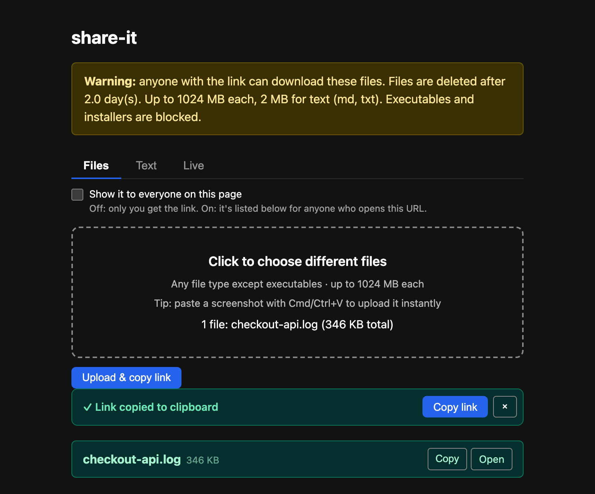
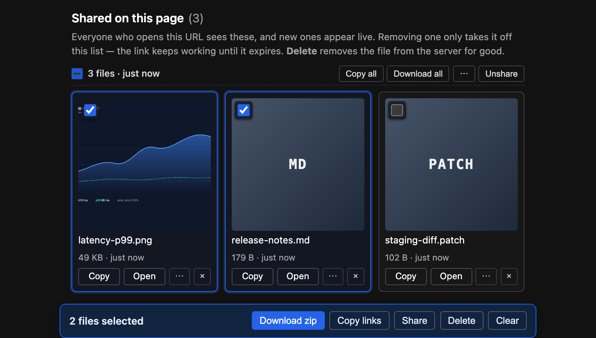

# share-it

**Can't paste it? Drop it here and get a link instead.**

A private drop zone on your own network. Drop a file, paste a screenshot, or dump a wall of text, and get back a URL you can hand to an AI chat, another device, or a teammate. No accounts, no cloud, nothing leaves your network.



## Why it exists

It started with one repeated annoyance: getting a long log into an **AI coding chat**. Long pastes get [truncated mid-word](https://github.com/anthropics/claude-code/issues/13125) or [silently dropped](https://github.com/anthropics/claude-code/issues/49673), and a big one can [freeze the session outright](https://github.com/anthropics/claude-code/issues/25952). And a paste is the only option at all when the thing you're talking to can't reach your disk.

The fix turned out to be simple: **stop pasting the content, share a link to it.** No size limit to trip over, no mangled text. Once it's running you reach for it everywhere else too, moving a file to a server, a screenshot to your phone, a log to a colleague.

## What it does

| | |
|---|---|
| **A link in one drop** | Drop files, or press Cmd/Ctrl+V to upload whatever's on your clipboard. The link is copied before you look up. |
| **Text without a file** | The **Text** tab shares a snippet, log, or markdown as its own link. |
| **Groups** | Files uploaded together stay one group, in the order you picked them. |
| **Bulk download** | **Download all** returns a whole group as one zip. It's streamed as it's built, so a multi-gigabyte batch costs the server megabytes, not gigabytes. |
| **Multi-select** | Tick any mix of files and the bar at the bottom will zip, copy, share, or delete them together. |
| **A shared list** | Tick *Show it to everyone* and the upload is listed for anyone on the URL, appearing live. Or hit **⋯ → Share** on something you uploaded earlier. |
| **A live clipboard** | The **Live** tab is one text buffer every browser on the URL shares, synced as you type. Readable and writable from the shell. |
| **Phone handoff** | **⋯ → QR** turns any link into a QR code to point a camera at. |
| **Markdown** | **⋯ → Copy MD** gives you `` for images, `[name](url)` otherwise. |
| **Expiry, or delete now** | Files self-delete after 2 days (configurable). **Delete** removes one, or a whole group, immediately. |
| **Shell** | `share report.pdf`, or pipe straight into it: `kubectl logs my-pod \| share -` |



Good fit if you want a link on your clipboard in three seconds, on a network you control (a [Tailscale](https://tailscale.com) tailnet, a LAN, or behind your own login). Not the tool for public sharing, per-person permissions, or long-term storage.

## Quick start

Requires Docker with the Compose plugin.

```bash
git clone <repo-url> share-it && cd share-it
make up
```

Open http://localhost:3050. It binds to `127.0.0.1` only. To reach it from other machines, pick one:

**Tailscale** (recommended, HTTPS for free, no firewall rules):

```bash
cp .env.example .env     # leave BIND_ADDR=127.0.0.1
tailscale serve https:443 / http://127.0.0.1:3050
```

**LAN** — set `BIND_ADDR` in `.env` to a specific LAN IP (or `0.0.0.0`), then `make restart`. Only on a network you control.

```bash
make down        # stop and remove
make restart     # after a config change
make version     # print current version
```

## Configure

Edit `config.yaml`, then `make restart`:

| Key | Default | What it does |
|-----|---------|--------------|
| `max_age_days` | `2` | Files older than this are swept on the next run |
| `max_upload_mb` | `1024` | Size cap for binary files |
| `max_upload_mb_text` | `2` | Smaller cap for `.txt` / `.md` |
| `cleanup_interval_sec` | `3600` | How often the sweeper runs |
| `blocked_extensions` | (long list) | Rejected at upload (executables, installers) |
| `pad_max_kb` | `128` | Size cap for the Live tab's text |
| `shared_max_items` | `500` | Entries the shared list holds before the oldest drop off |

Host-port binding lives in a gitignored `.env` (`cp .env.example .env` to change `BIND_ADDR` or `HOST_PORT`).

## Shell helper

```bash
echo 'source /path/to/share-it/scripts/share.sh' >> ~/.zshrc
export SHARE_IT_HOST=https://your-node.ts.net   # or http://localhost:3050
```

`share <file>` prints and copies the link; `some_command | share -` uploads piped output. Detects `pbcopy`, `wl-copy`, or `xclip`.

## API

`POST /upload` takes a multipart `file`. Send `Accept: text/plain` for just the URL back.

```bash
curl -sf -H "Accept: text/plain" -F "file=@report.pdf" http://localhost:3050/upload

# shared=1 lists it on the page; a shared batch=<id> keeps files one group
curl -sf -F "file=@a.png" -F "shared=1" -F "batch=friday" http://localhost:3050/upload

# several files back as one zip
curl -sf -o batch.zip "http://localhost:3050/zip?t=TOKEN1&t=TOKEN2"

# share files uploaded earlier, then delete one for good
curl -sf -X POST -H 'Content-Type: application/json' \
  -d '{"tokens":["TOKEN1","TOKEN2"]}' http://localhost:3050/shared
curl -sf -X DELETE http://localhost:3050/f/TOKEN1
```

| Endpoint | What it does |
|----------|--------------|
| `GET /f/<token>` | Serve the file inline (`?dl=1` forces a save dialog) |
| `DELETE /f/<token>` | Delete the upload for good, now |
| `GET /zip?t=&t=` | Stream several uploads as one zip (max 200, `&name=` to name it) |
| `GET` / `POST /shared` | Read the shared list, or add already-uploaded files to it |
| `DELETE /shared` / `/shared/<token>` | Take several, or one, off the list (files stay) |
| `GET` / `POST /pad` | Read or replace the Live tab's text |
| `GET /ws` | WebSocket carrying live pad and shared-list updates |
| `GET /healthz` | Liveness check, also returns the version |
| `GET /stats` | File count, total bytes, next expiry |
| `GET /version` | Current version string |
| `GET /qr?data=<url>` | SVG QR code for any URL |

## Security

**There is no authentication.** Anyone who can reach the port can download files by link, read and overwrite the Live pad, read the shared list, and delete any file whose token they have. Nothing here has an owner, a password, or an undo.

Deletion is the sharpest edge: `DELETE /f/<token>` needs only the token, which is the same secret as the download link, so a link you hand out is also a link that can destroy the file. Uploads are still private by default, a file is only listed if you tick the box.

That's the intended trade for a drop zone on a network you already trust. Run it on Tailscale, WireGuard, a LAN, or behind your own auth proxy, never bound to `0.0.0.0` on a public IP. Don't run it anywhere you wouldn't accept a stranger emptying the folder.

If a reverse proxy terminates the connection it needs to pass WebSocket upgrades through for `/ws` (`tailscale serve` already does). Without it the page still works, it just stops updating live.

## Versioning

`VERSION` holds the current SemVer, shown in the page footer and `/healthz`.

```bash
make bump-patch   # bug fixes      make bump-minor   # new features
make bump-major   # breaking       make up           # rebuild + redeploy
```
